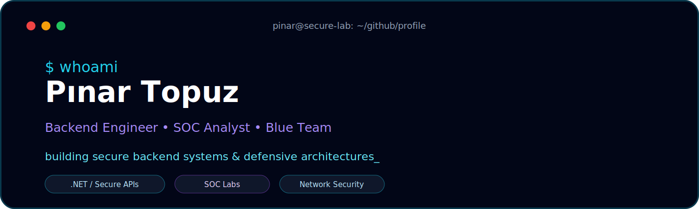

<div align="center">

  

  <br/><br/>

  

  <br/>

  

  <br/><br/>

  <p align="center">
    
    &nbsp;&nbsp;&nbsp;&nbsp;
    
    
    &nbsp;&nbsp;&nbsp;&nbsp;
    
  </p>

  <p align="center">
    
    
    
  </p>

  <p align="center">
    <sub><b>🕵️ bug hunter</b></sub>
    &nbsp;&nbsp;&nbsp;&nbsp;&nbsp;&nbsp;&nbsp;&nbsp;
    <sub><b>🚀 ship mode</b></sub>
  </p>

  <br/>

  
  
  
  

  <br/><br/>

  

  <br/>

  <sub>
    <b>while(coffee) &#123; build(); defend(); debug(); ship(); &#125;</b>
  </sub>

</div>

---

# ✦ Brand Identity

<table>
<tr>
<td width="55%">

```yaml
name: Pınar Topuz
role: Backend Engineer · SOC Analyst
location: Samsun, Türkiye
brand_positioning: Secure Backend Engineering
focus:
  - Scalable API Architecture
  - Clean Architecture
  - SIEM & Incident Response
  - Network Security
  - Threat Intelligence
  - Detection Engineering
```

</td>
<td width="45%">

### What I Build

▸ Production-grade backend systems
▸ Secure and observable APIs
▸ Blue Team focused security labs
▸ Network defense workflows
▸ Incident response foundations
▸ Systems designed for reliability

</td>
</tr>
</table>

I build software with an attacker-aware mindset.
My work combines **backend engineering**, **secure architecture**, and **defensive cybersecurity**.

> Architecture makes systems scalable. Security makes them trustworthy.

---

# ✦ Professional Dashboard

<div align="center">

<table>
<tr>
<td align="center" width="25%">

<br/><br/>
Scalable APIs<br/>Clean Architecture
</td>
<td align="center" width="25%">

<br/><br/>
SIEM<br/>Incident Response
</td>
<td align="center" width="25%">

<br/><br/>
Threat Intel<br/>Detection
</td>
<td align="center" width="25%">

<br/><br/>
CI/CD<br/>Linux
</td>
</tr>
</table>

</div>

---

# ✦ Technology Stack

<div align="center">

## Backend & Architecture


## Security & Blue Team


## Data, Cloud & Delivery


</div>

---

# ✦ GitHub Analytics Center

<div align="center">


<br/>


<br/>


</div>

---

# ✦ Contribution Snake

<div align="center">

<picture>
  <source media="(prefers-color-scheme: dark)" srcset="https://raw.githubusercontent.com/CodeByPinar/CodeByPinar/output/github-contribution-grid-snake-dark.svg" />
  <source media="(prefers-color-scheme: light)" srcset="https://raw.githubusercontent.com/CodeByPinar/CodeByPinar/output/github-contribution-grid-snake.svg" />
  
</picture>

</div>

> Snake grafiği için repo içinde GitHub Action gerekir. Action eklenmezse bu bölüm görünmeyebilir.

---

# ✦ Certifications

<div align="center">

| Certification                               | Provider                 | Status               |
| ------------------------------------------- | ------------------------ | -------------------- |
| 🛡 Cyber Threat Management                  | Cisco Networking Academy | Completed — May 2026 |
| 🌐 Getting Started with Cisco Packet Tracer | Cisco Networking Academy | Completed — May 2026 |
| 🔐 Introduction to Cybersecurity            | Cisco Networking Academy | Completed — Aug 2025 |
| ⚔ Ethical Hacking & Penetration Testing     | AltaySec                 | In Progress          |

</div>

---

# ✦ Current Mission

```text
01. Go Microservices & Distributed Backend Systems
02. Secure API Design & Clean Architecture
03. SOC Analyst Labs & Detection Engineering
04. SIEM, Incident Response & Threat Intelligence
05. Network Security with Cisco, Wireshark and Nmap
06. Production-ready DevOps with Docker and CI/CD
```

---

# ✦ Connect

<div align="center">

<a href="https://github.com/CodeByPinar">

</a>

<a href="https://www.linkedin.com/in/pinardev">

</a>

<a href="https://medium.com/@codebypinar">

</a>

<a href="mailto:piinartp@gmail.com">

</a>

</div>

---

<div align="center">


### “Secure systems are designed — never accidental.”

</div>
