<p align="center">
  
</p>

<h1 align="center">👩🏻‍💻 Pınar Topuz</h1>

<p align="center">
  
</p>

<p align="center">
  <b>Design-first Engineering · Security-aware Systems · Performance-driven Platforms</b>
</p>

<p align="center">

  
  
</p>

---

## 🧠 Executive Summary

```yaml
Role        : Principal-Level Full-Stack Engineer
Specialty   : Secure Web Platforms & Design Systems
Stack       : React · Next.js · TypeScript · .NET · DevOps
Security    : Bug Bounty · OWASP · API Security
Mindset     : Architecture-first · Zero-trust · Performance obsessed
```

---

## 🛡️ Security Credentials & Badges

<p align="center">
  
  
  
  
</p>

---

## 🗂️ Featured Projects (Pinned)

<table>
<tr>
<td width="50%">

### 🛡️ Karakurt Savunma Web *(Private)*

High-security defense-industry platform.

</td>
<td width="50%">

### 🧠 AtlasCRM

Next.js + Prisma CRM with auth, billing & admin panel.

</td>
</tr>
<tr>
<td>

### 🌌 interstellar-ml-3I-ATLAS

Physics-aware ML & time-series research project.

</td>
<td>

### ⚙ DotnetDevopsPipeline

.NET 8 Web API with CI/CD, Docker, Serilog.

</td>
</tr>
</table>

---

## 🧠 Threat Model (Mini Architecture)

```text
┌────────────┐    HTTPS + CSP     ┌────────────────┐    JWT + RBAC     ┌──────────────────┐    ORM Guards     ┌────────────┐
│   CLIENT   │ ─────────────────▶ │  API GATEWAY   │ ───────────────▶ │ BACKEND SERVICES │ ───────────────▶ │  DATABASE  │
└────────────┘                     │ Rate Limit     │                  │ Business Logic   │                  │  Encrypted │
                                   │ WAF / Filters  │                  │ Input Validation │                  │  Storage   │
                                   └────────────────┘                  └──────────────────┘                  └────────────┘

```

---

## 💼 Why Hire Me?

* I bridge **engineering + design + security**
* I build systems **ready for audits & scale**
* I think in **architecture, not just features**
* I reduce tech debt **before it happens**
* I mentor teams and raise engineering standards

---

## 🧪 Architecture Decision Records (ADR)

```text
ADR-001: API-first architecture for scalability
ADR-002: JWT with short-lived access tokens
ADR-003: Defense-in-depth security model
ADR-004: Design system tokenization
```

---

## 📐 System Quality Metrics

| Quality Attribute | Approach                |
| ----------------- | ----------------------- |
| Performance       | SSR, caching, profiling |
| Security          | OWASP, Zero Trust       |
| Maintainability   | Clean Architecture      |
| Scalability       | Stateless APIs          |
| Accessibility     | WCAG-driven UI          |

---

## ⏱ Live Engineering Status

<p align="center">


</p>

---

## 🌍 Open Source Impact

```yaml
Public Repos      : 30+
Stars Received   : Growing
CI/CD Templates  : Reusable
Dev Tools Built  : Fiber Inspector, Pipelines
```

---

## 📊 Contribution Patterns

<p align="center">
  
</p>

---

## 🧠 CTF & Bug Bounty Timeline

```text
2024 ▸ Web Exploitation, OWASP Labs
2025 ▸ Private Bug Bounty Programs
2026 ▸ Advanced API & Auth Research
```

---

## 🎯 Continuous Improvement Loop

```mermaid
%%{init: {
  "theme": "base",
  "themeVariables": {
    "primaryColor": "#0b0f1a",
    "primaryTextColor": "#e6faff",
    "primaryBorderColor": "#00f7ff",
    "lineColor": "#ff00ff",
    "fontFamily": "Fira Code",
    "fontSize": "14px"
  }
}}%%
graph LR
    A[🎨 DESIGN] --> B[🛠 BUILD]
    B --> C[🧪 TEST]
    C --> D[🔐 SECURE]
    D --> E[🚀 DEPLOY]
    E --> A

    style A fill:#0b0f1a,stroke:#00f7ff,stroke-width:2px,color:#00f7ff
    style B fill:#0b0f1a,stroke:#00ff9c,stroke-width:2px,color:#00ff9c
    style C fill:#0b0f1a,stroke:#ffe600,stroke-width:2px,color:#ffe600
    style D fill:#0b0f1a,stroke:#ff00ff,stroke-width:2px,color:#ff00ff
    style E fill:#0b0f1a,stroke:#ffffff,stroke-width:2px,color:#ffffff

```



---

<h2 align="center">🔗 Connect</h2>

<p align="center">
  <a href="https://github.com/CodeByPinar">
    
  </a>
  <a href="https://www.linkedin.com/in/pinardev">
    
  </a>
  <a href="https://medium.com/@codebypinar">
    
  </a>
  <a href="mailto:piinartp@gmail.com">
    
  </a>
</p>
